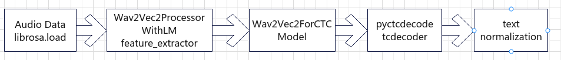

# Kaggle Competition
[Bengali Speech Recognition](https://www.kaggle.com/competitions/bengaliai-speech)
# DATA
## TRAIN DATA
* Audio: 1200 hours of recordings of Bengali speech
* train.csv
  *  id: A unique identifier for this instance.
  * sentence:  A plain-text transcription of the recording.
  * split: Whether train or valid. The annotations in the valid split have been manually reviewed and corrected, while the annotations in the train split have only been algorithmically cleaned.
* sample_submission.csv
  * id: A unique identifier for instance
  * sentence: model's prediction
## TEST DATA
* Out-of-distribution with respect to the training set: meaning test set is different from training set. For example
  * Accent
  * Background noise
  * Recording conditions
  * Speaking styles
  * Dialects

# Evaluation
* Word Error Rate (WER) is used

    The WER is derived from the Levenshtein distance, working at the word level instead of the phoneme level 
    * WER = (S + I + D) / N 
    
    Where
    * S is the number of word substitutions (words incorrectly recognized by the system).
    * I is the number of word insertions (words present in the system's output but not in the reference).
    * D is the number of word deletions (words present in the reference but not recognized by the system).
    * N is the total number of words in the reference transcription.
# Understanding some notebooks
## Bengali Speech Recognition for everyone. 
[URL](https://www.kaggle.com/code/sujaykapadnis/bengali-speech-recognition-for-everyone/notebook#Step-0---Introduction)
### 1. Data Summary
### 2. Working with audio

  2.1. Listen audio file
  ```python
  librosa.load(audio_file_path, sr=None)
  ```      
  2.2. Load waveform
  ```python
  librosa.display.waveshow(audio, sr=sr)
  ```
  2.3. Load and show mel spectrogram

  ```python
  mel_spec = librosa.feature.melspectrogram(y=audio, sr=sr)
  mel_spec_db = librosa.power_to_db(mel_spec, ref=np.max)
  librosa.display.specshow(mel_spec_db, sr=sr, x_axis='time', y_axis='mel')
  ```

### 3. Working with text

  3.1 Word processing
    
  Remove punctation -> Tokenization -> remove stopwords -> word stemming: using nltk and string libraries
    
  3.2 Make vocabulary list

  Using tokenizer over all sentences
  
  3.3 Analysis of sentence length
        
  Histogram, min, max, mean, median

  3.4 Word frequency analysis

  Tokenize sentences -> make a word counter

  3.5 Document topic analysis

  ```python
    # Tokenize sentences -> remove stop_words -> join list of words into sentence (using space) -> then do these
    # Create a CountVectorizer to convert text data to a bag-of-words representation
    vectorizer = CountVectorizer(max_features=1000)
    X = vectorizer.fit_transform(sentences_processed)
    # Perform LDA topic modeling
    n_topics = 10  # Number of topics to discover
    lda_model = LatentDirichletAllocation(n_components=n_topics, random_state=42)
    # Get the top words for each topic
    feature_names = vectorizer.get_feature_names_out()
    top_words_per_topic = []
    for topic_idx, topic in enumerate(lda_model.components_):
        top_words = [feature_names[i] for i in topic.argsort()[:-4:-1]]
        top_words_per_topic.append(top_words)

    # Print the top words for each topic
    for i, top_words in enumerate(top_words_per_topic):
      print(f"Topic {i + 1}: {' '.join(top_words)}")
  ```
  3.6 Domain analysis

  Number of domain is 18
      
  ```python
  DOMAINS = [Audiobook.wav', 'Parliament Session.wav', 'Bangladeshi TV Drama.wav', 'Poem Recital.wav', 'Bengali Advertisement.wav', 'Puthi Literature.wav', 'Cartoon.wav', 'Slang Profanity.mp3', 'Debate.wav', 'Stage Drama Jatra.wav', 'Indian TV Drama.wav', 'Talk Show Interview.wav', 'Movie.wav','Telemedicine.mp3', 'News Presentation.wav', 'Waz Islamic Sermon.wav', 'Online Class.wav']

  ```
### 4. Building model
  
  4.1 Requirements

  | Lib    | Details |
  | -------- | ------- |
  | jiwer  | word error rate calculation    |
  | pyctcdecode | CTC decoding for Wav2Vec2     |
  | bnunicodenormalizer    | bengali unicode normalization    |
  | pypi-kenlm    | KenLM languague model    |
  | Wav2Vec2Processor, Wav2Vec2ProcessorWithLM, Wav2Vec2ForCTC   | For loading and processing Wav2Vec2 models    |

  4.2 Loading models

  ```python
  # Load Wav2Vec2 model and processor
  model = Wav2Vec2ForCTC.from_pretrained(MODEL_PATH)  # CTC instance
  # processor will be responsible for handling the audion data
  processor = Wav2Vec2Processor.from_pretrained(MODEL_PATH)
  ```

  4.3 Build ctc decoder

  Using pyctcdecode.build_ctcdecoder(vocab_list, languague_model_file)
  
  4.4 Combine processor for Wav2Vec2 model input and languague model decoding
  
  ```python
  processor_with_lm = Wav2Vec2ProcessorWithLM(feature_extractor = processor.feature_extractor, tokenizer = processor.tokenizer, decoder = decoder)
  ```
### 5. Build dataset and dataloader

  5.1 Build dataset

  ```python
  def __getitem__(self, index: int):
      audio_path = self.audio_paths[index]
      # 
      sr = self.sampling_rate
      audio_signal = librosa.load(audio_path, sr=sr, mono=False)[0]
      return audio_signal
  ```
  5.2 Use feature_extractor in processer_with_lm to build collate_func

  ```python
  collate_func = partial(processor_with_lm.feature_extractor, return_tensors="pt", sampling_rate=SAMPLING_RATE, padding=True)
  ```

### 6. Inference

  6.1 Use model to run inference

  ```python
  with torch.cuda.amp.autocast(True):
    y = model(x).logits  # Get the model's output logits
    del x
    y = y.detach().cpu().numpy()  # Move the logits to the CPU and convert to a numpy array
  for l in y:  # Iterate through the logits of the batch
    # Decode the logits into a sentence using the LM with beam search decoding
    sentence = processor_with_lm.decode(l, beam_width=64).text
  ```

  6.2 Post processing

  ```python
  bnorm = Normalizer()  # Create a Normalizer object for text normalization

  def postprocess(sentence):
    # Define a postprocessing function to clean up and format predicted sentences
    
    period_set = set([".", "?", "!", "।"])  # Set of sentence-ending punctuation
    
    # Split the sentence into words and apply normalization using the Normalizer
    _words = [bnorm(word)['normalized'] for word in sentence.split() if word]
    
    sentence = " ".join(_words)
    
    if not sentence.endswith(tuple(period_set)):
        sentence += "।"
    return sentence
  ```
### Inference Pipeline


  
    
  


    
      

  


